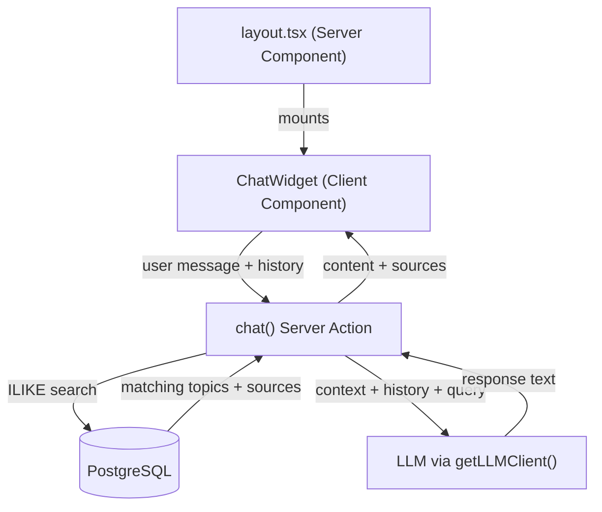

# ADR-001: Knowledge Base Chat Widget

## Status

Proposed

## Context

Paramedic personnel need a way to query the operational knowledge base conversationally — asking natural language questions and getting answers grounded in the topic guidance and evidence already in the system.

**Requirements:**
- Open a chat window from a persistent floating button on the lower right of every page
- Accept user questions about topics, guidance, and sources
- Retrieve relevant knowledge from the database when answering
- Generate conversational responses using the LLM, grounded in actual topic/source data
- Maintain conversation history within the chat session for follow-up questions
- Show source attributions so users know which topics informed the response
- Display loading and error states inline in the chat window
- Available to authenticated users across all routes

## Architecture Overview



## Key Decisions

### 1. Widget mounted in root layout

**Decision:** `ChatWidget` is mounted in `src/app/layout.tsx` alongside `<header>` and `<main>`.

**Alternatives considered:**
- Mount per-page (each page individually includes the widget)
- Mount via a route group layout

**Why:** The widget should be available on every page without any per-page wiring. The root layout is the single place that guarantees this.

**Trade-off:** The widget loads on every page, including the login page. Acceptable at this scale — the widget simply won't show meaningful results if the user isn't authenticated, and auth-gating can be added in the Server Action.

---

### 2. Knowledge retrieval via ILIKE text search, not vector embeddings

**Decision:** The `chat` Server Action searches topics using SQL `ILIKE` across `title`, `summary`, and `guidance` fields — no vector store or embedding model.

**Alternatives considered:**
- pgvector with semantic embeddings
- External vector database (Pinecone, Weaviate)

**Why:** The knowledge base has ~41 topics. At this scale, keyword search is fast, zero-infrastructure, and easy to reason about. Semantic search adds real complexity (embedding pipeline, vector indexing, additional dependencies) with minimal recall benefit for a small, well-structured dataset.

**Trade-off:** Keyword search will miss semantically related topics if the user uses different terminology (e.g., "heart attack" vs "ACS"). Mitigated by the LLM's ability to rephrase and the structured nature of medical terminology in the dataset.

---

### 3. Stateless retrieval per turn

**Decision:** The Server Action runs a fresh knowledge search for every message — it does not accumulate retrieved context across turns.

**Alternatives considered:**
- Cache retrieved topics for the session duration
- Send all topics as context every time

**Why:** Sending all topics every time would bloat the prompt significantly (41 topics × guidance text). Per-turn search keeps the context focused on what's relevant to the current question. Session caching adds complexity without clear benefit at this scale.

**Trade-off:** Follow-up questions run their own independent search, which may retrieve different topics than the initial turn. The conversation history passed to the LLM provides continuity.

---

### 4. Self-contained ChatWidget with no external props

**Decision:** `ChatWidget` manages all its own state (open/closed, messages, loading) and requires no props from the layout.

**Alternatives considered:**
- Pass initial context (e.g., current page topic) as props from the layout
- Use global state (Zustand, Context) to share chat state

**Why:** The widget is a standalone overlay. No parent component has information it needs at mount time. Keeping it self-contained makes it trivially easy to mount and test.

**Trade-off:** Can't pre-load context from the current page (e.g., auto-focusing the chat on the topic the user is currently reading). A future improvement could accept an optional `contextTopicId` prop.

## Appendix: Design Levels

<details>
<summary>Full design conversation (click to expand)</summary>

### Level 1: Capabilities

- Open a persistent chat window from the lower-right floating button without navigating away from the current page
- Accept user questions about the knowledge base (topics, guidance, evidence)
- Retrieve relevant knowledge from the database when answering (search topics and sources related to the query)
- Generate conversational responses using the LLM, grounded in the actual topic/source data
- Maintain conversation history within the chat session so users can ask follow-up questions
- Close the chat window without losing the page context
- Show loading state while waiting for LLM responses
- Display error messages if the LLM is unavailable
- Show sourcing — indicate which topics or sources informed the response

### Level 2: Components

| Component | Type | Location | Responsibility |
|---|---|---|---|
| ChatWidget | Client Component | `src/app/components/ChatWidget.tsx` | Floating button + chat window UI — owns open/closed state, message list, input field, loading state |
| Chat Server Action | Server Action | `src/app/chat/actions.ts` | Receives user message + history, queries knowledge base, calls LLM, returns response with source attributions |
| Layout (modified) | Server Component | `src/app/layout.tsx` | Mount ChatWidget so it's available on every page |

### Level 3: Interactions

**Sending a message:**
1. User submits message in ChatWidget
2. ChatWidget appends user message to local `messages` state, sets `isLoading: true`
3. ChatWidget calls `chat` Server Action with message + full history
4. Server Action: ILIKE-searches topics table across title/summary/guidance (up to 5 results)
5. Server Action: fetches sources for each matched topic
6. Server Action: builds context block + history + query → sends to LLM
7. Server Action: extracts response text and topic IDs used as context
8. Server Action returns `{ content, sources }`
9. ChatWidget appends assistant message with attributions, sets `isLoading: false`

**Error handling:** Server Action throws → ChatWidget catches → appends inline error message

**Follow-up questions:** Full `messages` array passed each turn; knowledge retrieval runs fresh per turn

### Level 4: Contracts

```typescript
interface ChatMessage {
  role: "user" | "assistant";
  content: string;
}

interface SourceAttribution {
  topicId: number;
  topicTitle: string;
  area: string | null;
}

interface ChatResponse {
  content: string;
  sources: SourceAttribution[];
}

interface UIMessage {
  id: string;
  role: "user" | "assistant" | "error";
  content: string;
  sources?: SourceAttribution[];
}

interface TopicContext {
  id: number;
  title: string;
  area: string | null;
  summary: string;
  guidance: string;
  sources: Array<{ title: string; content: string; sourceType: string }>;
}

export async function chat(
  message: string,
  history: ChatMessage[],
): Promise<ChatResponse>

export function ChatWidget(): JSX.Element
```

</details>
