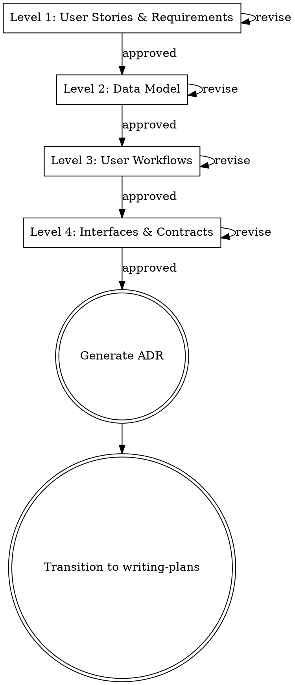

# Feature Design: From User Stories to Contracts

Structured feature decomposition in four levels, each requiring user approval before proceeding. No code until interfaces are agreed. After approval, decisions are captured as an ADR.

**Position in workflow:** After brainstorming (what to build) → **this skill** → writing-plans (implementation steps)

## Process Flow

<HARD-GATE>
Each level MUST be presented separately and approved before moving to the next. Do NOT combine levels, skip levels, or present code at any level. The only code-like artifacts allowed are type/interface signatures at the Contracts level.
</HARD-GATE>

## The Four Levels

### Level 1: User Stories & Requirements

**Question:** What does this feature need to DO from the user's perspective?

Write user stories in the format: "As a [user], I want to [action], so that [benefit]." Include acceptance criteria for each story. Focus on user intent, not implementation.

**Include:** User roles, actions, success criteria, edge cases
**Exclude:** Technical implementation, data structure, API details

**Ask:** "Do these stories capture the feature? Anything missing, extra, or unclear?"

### Level 2: Data Model

**Question:** What data structures do we need?

Identify entities, attributes, and relationships. Reference your existing schema patterns (Drizzle tables, relationships). Show what's new vs. modified.

**Include:** Tables/entities, key attributes, relationships, constraints
**Exclude:** Implementation details (column types, indexes), API endpoints (→ Level 4)

**Ask:** "Does this data model support the user stories?"

### Level 3: User Workflows

**Question:** How does a user interact with this feature end-to-end?

Describe the happy path and key variations. Numbered steps showing the user's journey and system responses.

**Include:** User actions, system responses, state transitions, error cases
**Exclude:** Implementation details (function names, HTTP methods), type definitions (→ Level 4)

**Ask:** "Do these workflows feel right from the user's perspective?"

### Level 4: Interfaces & Contracts

**Question:** What are the exact APIs and data contracts?

Type signatures, DTO shapes, API endpoints (method, path, request/response). This is the most concrete level before code.

**Include:** Server Actions / API endpoints, component props, database query signatures, response shapes
**Exclude:** Implementation (function bodies), data flow details (→ Level 3)

**Ask:** "Do these interfaces look right? Once approved, I'll generate an ADR and move to implementation planning."

## Rules

**One level per message.** Present one level, ask for approval, wait. Do not preview the next level.

**User-centric before technical.** Stories → Model → Workflows → Interfaces. Never jump ahead.

**Read the codebase first.** Before presenting the Data Model, read existing schema and patterns. Mirror what exists — don't invent conventions.

**No code until contracts are agreed.** Type signatures at Interfaces are the closest thing to code allowed.

## Red Flags — You Are Violating This Skill

| Rationalization | Reality |
|----------------|---------|
| "This feature is simple, we can skip stories" | Simple features have hidden assumptions. Write the stories. |
| "The data model is obvious from the stories" | Obvious to you. Present it and let the user confirm. |
| "I'll present everything and ask for feedback at the end" | Feedback on a wall of text is always "looks fine." Incremental review catches issues. |
| "We can decide interfaces once we start coding" | Contracts are where you catch misalignment. Decide before coding. |
| "These are just internal workflows, not worth documenting" | Workflows are where you test whether the data model works. Don't skip. |

## After All Four Levels Are Approved: Generate ADR

Once all four levels are approved, generate an Architecture Decision Record.

### Step 1: Ask target repo

Ask the user: "Which repo's `<repo>/docs/adr/` should I save the ADR to?"

### Step 2: Auto-detect ADR number

For the target repo, list `docs/adr/` to find the highest existing number. The new ADR gets the next number (e.g., if `002-*.md` exists, create `003-*.md`). Create `docs/adr/` if it doesn't exist.

### Step 3: Generate ADR

Follow the template in `references/adr-template.md`. Map design levels to ADR sections:

| ADR Section | Source |
|---|---|
| **Context** | Level 1 (User Stories) — what we're building and why |
| **Data Model** | Level 2 — entities, attributes, relationships |
| **User Workflows** | Level 3 — end-to-end journeys with system behavior |
| **Key Decisions** | Extracted from all levels — the "why" behind each choice |
| **Appendix** | Collapsible `
` with the full 4-level design as presented and approved |

### Step 4: Save and transition

Save the ADR file(s), then transition to `superpowers:writing-plans` for implementation planning.
